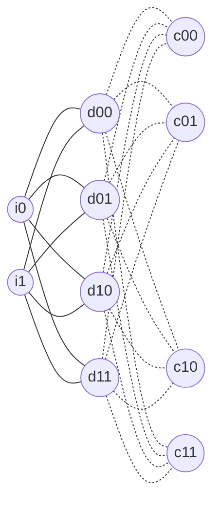

# understatingKerasLayers

## Dense Layer

$$
output = activation(dot(input, kernel) + bias)
$$

```
    tf.keras.layers.Dense(4) # d
    tf.keras.layers.Dense(4) # c
```


```mermaid
%% {init: { 'curve': 'linear'}}

graph LR
    i0((i0))
    i1((i1))

    d00((d00))
    d01((d01))
    d10((d10))
    d11((d11))

    c00((c00))
    c01((c01))
    c10((c10))
    c11((c11))

    i0 & i1 --- d00 & d01 & d10 & d11 -.- c00 & c01 & c10 & c11

```
